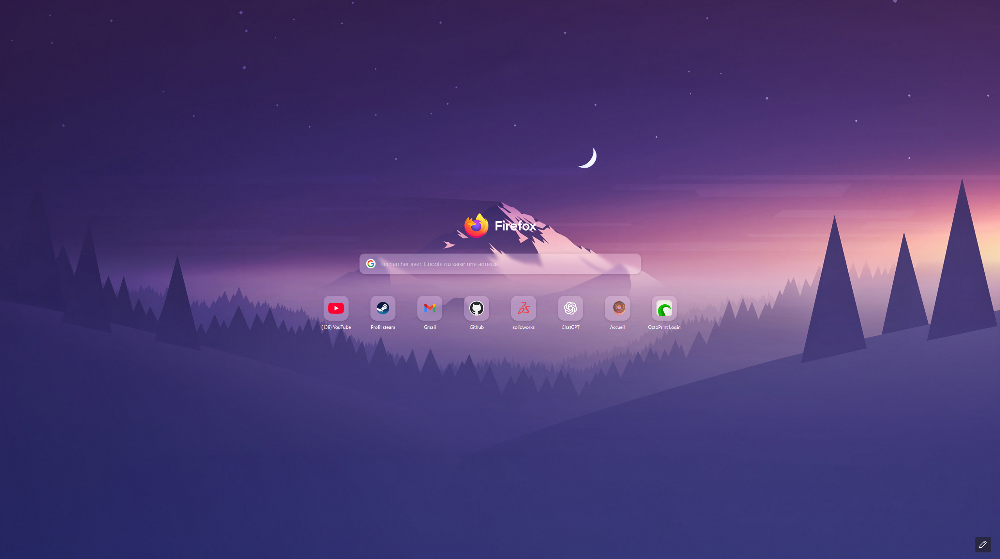

[VWallpaper from WallHere](https://wallhere.com/fr/wallpaper/1244561)

# Firefox New Tab CSS Customization

This guide shows how to customize the Firefox **new tab / home page** with custom CSS (`userContent.css`).  
You can add transparency and blur effects (glassmorphism) to the shortcuts tiles and the search bar.

## 1. Enable custom stylesheets

1. Go to `about:config`.
2. Set these preferences to **true**:
   - `toolkit.legacyUserProfileCustomizations.stylesheets`

## 2. Locate your Firefox profile

1. Open `about:support`.
2. In **Profile Folder**, click **Open Folder**.
3. Inside, create a folder named `chrome` (if it doesn’t exist).

## 3. Create `userContent.css`

Copy the file `userContent.css` from this repository inside the `chrome` folder.

Restart your browser to apply the stylesheet.
